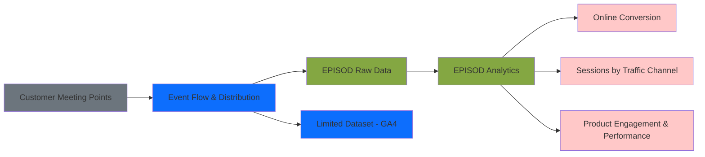
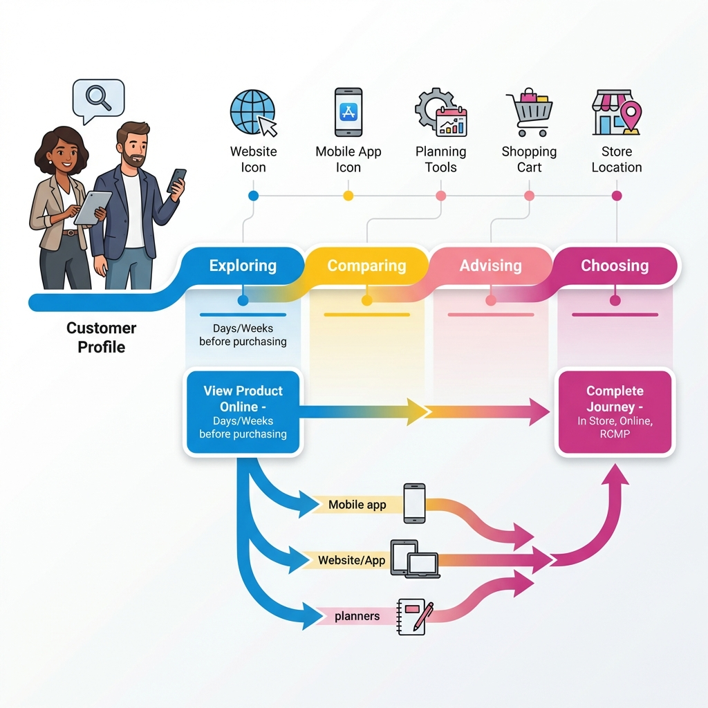

# E-commerce Business Intelligence & Analytics Platform

> **Advanced Online Performance Analytics at Regional Granularity**

A comprehensive data analytics solution designed to consolidate and visualize e-commerce performance metrics across multiple geographic levels (Country, Market, and Sales Areas), enabling data-driven decision-making for retail operations teams.

---

## 📊 Project Overview

This project addresses the gap in granular e-commerce analytics by providing market-level insights into online customer behavior, product engagement, and conversion performance. The platform integrates multiple data sources to deliver actionable insights for:

- **Sales Teams** - Identifying sales opportunities through product engagement analysis
- **Business Navigation Teams** - Understanding conversion patterns at market and sales area levels
- **E-commerce Performance Teams** - Supporting decision-making with detailed conversion and engagement data

<!-- Optional: Add screenshot from your presentation showing the main project overview -->

### Key Problem Solved

Previously, e-commerce insights were only available at the **country level**. This platform extends analytics to the **PMA (Primary Market Area)** and **FSA (Forward Sortation Area)** levels, enabling localized business strategies and performance optimization.

---

## 🎯 Core Features


*Figure 1: New granular information available at PMA and FSA levels*

### 📍 Geographic Performance Analysis
- **Multi-level segmentation**: Country → Market → FSA → City
- **Location-based metrics**: Track sessions, revenue, and conversion by geographic area
- **Regional comparisons**: Benchmark performance across different markets

### 🛒 Customer Journey Mapping
- **Omnichannel tracking**: Web, mobile apps, in-store kiosks, and planners
- **Journey stages**: Exploring → Comparing → Advising → Choosing
- **Touchpoint analysis**: Understand customer behavior across digital platforms

### 📈 Conversion & Funnel Analytics
- **Funnel visualization**: Track customer progression from view to purchase
- **Conversion metrics**: 
  - Overall conversion rate
  - Middle funnel conversion
  - Lower funnel conversion
  - Add-to-cart rate
- **Performance benchmarking**: Compare against historical data and targets

### 🎨 Product Engagement Insights
- **View tracking**: Monitor product views and engagement patterns
- **Add-to-cart analysis**: Identify high-performing products
- **Category performance**: Analyze engagement by product category
- **Actionable recommendations**: Surface top online-viewed products for in-store merchandising

### 📊 Traffic & Session Analytics
- **Session monitoring**: Track user sessions by channel and device
- **Traffic source analysis**: Understand customer acquisition channels
- **Temporal patterns**: Identify trends over time

---

## 🏗️ Technical Architecture

### Data Infrastructure

```
Customer Touchpoints → Data Collection → Processing → Analytics
(Web, Apps, Kiosks)   (EPISOD Framework)   (GA4, Cloud)   (Dashboards)
```

#### **Data Sources**
1. **Common Sales Dataset**
   - Sales transactions across all channels
   - Revenue and goal tracking
   - Transaction-level data

2. **EPISOD (Event Platform for Integrated Sales & Online Data)**
   - Real-time event tracking
   - Customer interaction data from:
     - Web products
     - Mobile applications
     - In-store kiosks
     - Digital planners
   - Encrypted data transmission

#### **Data Pipeline**




*Figure 2: EPISOD Data Framework - Event flow and data distribution*

### Technology Stack

| Layer | Technology |
|-------|-----------|
| **Cloud Infrastructure** | Google Cloud Platform (GCP) |
| **Data Processing** | EPISOD Framework (Event-based) |
| **Analytics Engine** | Google Analytics 4 (GA4) |
| **Data Security** | Encrypted data transmission & storage |
| **Business Intelligence** | Custom dashboards & reporting tools |
| **Data Integration** | Real-time event streaming |

---

## 📱 Analytics Outputs


*Figure 3: Customer buying journey across digital touchpoints*

### 1. **Business Navigation Reports**
Performance scorecards showing:
- Sales amount (net)
- Visitation sessions
- Number of transactions
- Conversion rates (overall, middle funnel, lower funnel)
- Add-to-cart rates
- Year-over-year comparisons

### 2. **Geographic Performance Dashboards**

<!-- Optional: Add sanitized screenshot from slide showing Business Navigation Report -->
<!--  -->
<!-- *Figure 4: Business Navigation Online Performance Report with key metrics* -->

<!-- Optional: Add sanitized screenshot from slide showing Geographic Performance charts -->
<!--  -->
<!-- *Figure 5: Online performance tracked by city and FSA with revenue metrics* -->

- City-level: Tracked sessions and revenue
- FSA-level: Tracked sessions and revenue
- Detailed breakdowns with conversion metrics
- Index comparisons against previous fiscal year

### 3. **Product Insights Reports**
- Top online-viewed products by category
- Product engagement metrics
- Recommendations for in-store merchandising
- Correlation analysis: online views vs. in-store sales

---

## 💼 Use Cases & Business Impact

### Use Case 1: **Online Performance Metrics by Market**
**Stakeholders**: Business Navigation Teams, E-commerce Teams  
**Objective**: Monitor and optimize conversion rates at PMA and FSA levels

**Impact**: Enable localized strategies based on regional performance patterns

---

### Use Case 2: **Conversion Optimization Using Product Insights**
**Stakeholders**: Sales Teams, Marketing Teams  
**Objective**: Identify high-engagement products for promotional activities

**Impact**: Data-driven product placement and inventory management

---

### Use Case 3: **In-Store Sales Steering**
**Stakeholders**: Showroom Teams, Sales Associates  
**Objective**: Leverage online engagement data to inform in-store merchandising

<!-- Optional: Add sanitized screenshot from slide showing product insights use case example -->
<!--  -->
<!-- *Figure 6: How online insights drive in-store merchandising decisions* -->

**Real-World Example**:
> *"Analysis revealed that a specific desk combination was highly viewed online in a particular market area. By physically displaying this product in a showroom hotspot, in-store sales doubled within a two-week period."*

**Methodology**:
1. Analyze top-viewed products online by market (PMA)
2. Identify products with high online engagement but low in-store visibility
3. Create targeted in-store displays in high-traffic areas
4. Measure sales impact over 2-4 week period

---

## 🎓 Skills Demonstrated

### Data Analysis & Visualization
- Multi-dimensional data analysis (geographic, temporal, categorical)
- Funnel analysis and conversion optimization
- Dashboard design and KPI tracking

### Business Intelligence
- Stakeholder requirement gathering
- Cross-functional collaboration (sales, marketing, e-commerce)
- Actionable insight generation

### Technical Expertise
- Cloud-based data architecture (GCP)
- Event-driven analytics frameworks
- Data pipeline management
- Real-time analytics implementation

### E-commerce Analytics
- Customer journey mapping
- Omnichannel behavior analysis
- Product performance tracking
- Geographic segmentation

---

## 📈 Key Metrics Tracked

| Metric Category | Specific Metrics |
|-----------------|------------------|
| **Revenue** | Sales amount (net), Tracked revenue |
| **Engagement** | Sessions, Product views, Add-to-cart events |
| **Conversion** | Overall conversion, Middle funnel conversion, Lower funnel conversion |
| **Performance** | Add-to-cart rate, Transaction count, Session-to-sale ratio |
| **Geographic** | Performance by country, market, FSA, and city |
| **Temporal** | YoY comparisons, Fiscal period tracking |

---

## 🚀 Project Outcomes

✅ **Granular Insights**: Extended analytics from country-level to market and FSA levels  
✅ **Data Integration**: Unified sales and online analytics data sources  
✅ **Actionable Intelligence**: Enabled data-driven merchandising and sales strategies  
✅ **Business Impact**: Demonstrated measurable revenue increase through online-to-offline insights  
✅ **Scalable Architecture**: Built on cloud infrastructure supporting real-time data processing  

---

## 👨‍💼 Role & Responsibilities

As an **E-commerce Analyst** and **Brand Advocate Analyst**, key responsibilities included:

- Designing and implementing the analytics framework for regional performance tracking
- Integrating EPISOD event data with traditional sales datasets
- Creating business intelligence dashboards for stakeholder teams
- Analyzing customer journey patterns across digital touchpoints
- Providing actionable recommendations for sales and marketing teams
- Collaborating with cross-functional teams to define KPIs and success metrics
- Presenting insights to business navigation and e-commerce leadership

---

## 🔒 Data Privacy & Security

- All customer data is encrypted during transmission and storage
- Compliance with data privacy regulations
- Secure cloud infrastructure on Google Cloud Platform
- Limited dataset distribution for specific analytics use cases (GA4)

---

## 📊 Sample Insights

### Performance Benchmark Example (Anonymized)
| Metric | Country | Market A | Market B |
|--------|---------|----------|----------|
| Sales Net | $126.4M | $39.8M | $5.2M |
| Sessions | 24.8M | 6.5M | 889K |
| Conversion Rate | 0.93% | 1.19% | 1.07% |
| Add-to-Cart Rate | 6.52% | 7.90% | 7.33% |

*Performance metrics demonstrate variance across regions, enabling targeted optimization strategies.*

---

## 🛠️ Future Enhancements

- Predictive analytics for sales forecasting
- Machine learning models for product recommendation optimization
- Real-time alerting for performance anomalies
- Enhanced mobile app tracking capabilities
- Customer segmentation and cohort analysis

---

## 📝 License

This project documentation is for portfolio demonstration purposes.

---

**Built with**: Google Cloud Platform • EPISOD Framework • Google Analytics 4 • Event-Driven Architecture

**Project Timeline**: November 2025 (Pilot Evaluation Phase)
